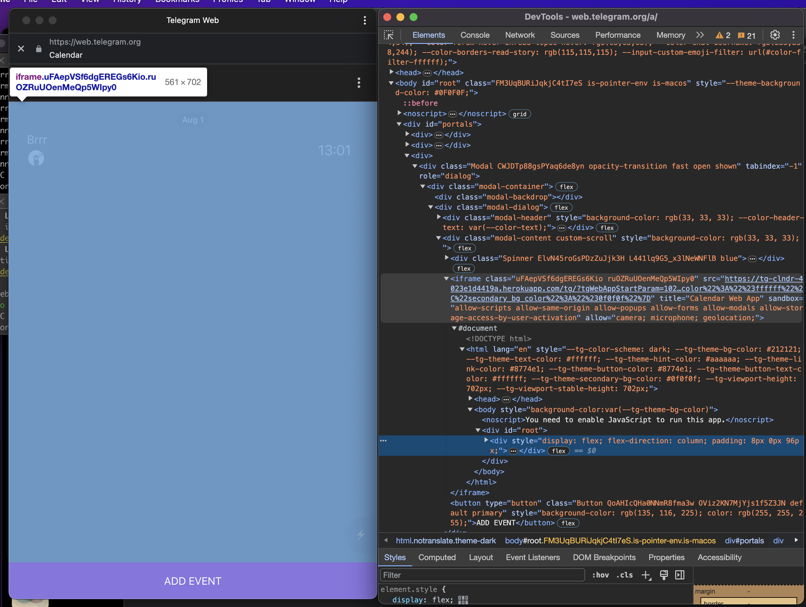

[@clndrrrbot](https://t.me/clndrrrbot) - a Mini app alowing managing shared calendar for chats - with a seamless integration with calendar apps on both Android and iOS.

# Running locally

## Setup
### DB
Mongodb is used as a database for this project, so you'll need one to run this app, you can get one for free here: https://www.mongodb.com/
### Telegram bot
You'll need a telegram bot token in order to run this app, you can get on here: https://t.me/botfather
Also, you'll need to set up a web app for this bot using `botfather` `/newapp` command. Web app URL for this app should include `/tg/` path (eg `https://your-app-id.herokuapp.com/tg/`)

### .env
Once you have aqired mongodb URI and telegram bot token, rename [example.env](example.env) to .env, update MONGODB_URI and TELEGRAM_BOT_TOKEN fields accordingly.

## Running locally in dev mode
To run app locally in dev mode you'll have to run two **separate** processes - app server and react dev server:

### run server: ```yarn buildServer && yarn startServer```
### run react dev server: ```yarn start```

After that, you should see an empty tab pointing to http://localhost:3000/.

In order to run actual tApp content you'll have to start tApp with the same params as the Telegram client would - passing path you configured for your tApp using `botfather`, `tgWebAppStartParam`, and `#tgWebAppData`.

These params can be easily acquired using Telegram web client: 
- set up this project as described in the "Setup" section
- run a server if it is not already: `yarn buildServer && yarn startServer`
- send `/pin` command to the bot
- open tApp using button provided (it won't work if it is not deployed yet - it's fine) in a telegram web app (https://web.telegram.org)
- open dev tools
- locate tApp iframe 
- copy `src` attribute from iframe
- replace origin with `localhost:3000`
- open resulting url
- congrats, app is running in dev mode

# Deployment
This project is ready to be deployed on [heroku](https://heroku.com/), thx to [Procfile](./Procfile)

# Project structure
`/src/shared` - types used both on server and client side

`/src/utils` - utils used both on client and server-side

## Client
`/src/index.tsx` - client entry point

`/src/model` - client application model (working with API, data sync, value models, etc)

`/src/view` - UI-related code, screens, components etc

## Server
`/server/src/index.ts` - server entry point, HTTP API, SSR

`/server/src/api/tg` - telegram bot client - handling messages, telegram bot updates, etc

`/server/src/api/ClientApi.ts` - websocket API for tApp - updates, data sync, etc

`/server/src/modules` - server-side model layer

`/server/src/utils` - MongoDB wrappers, utils